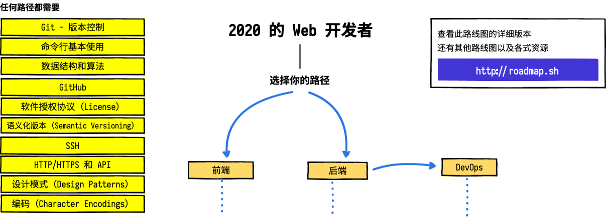
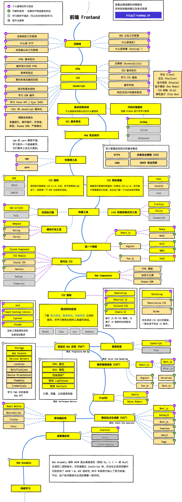
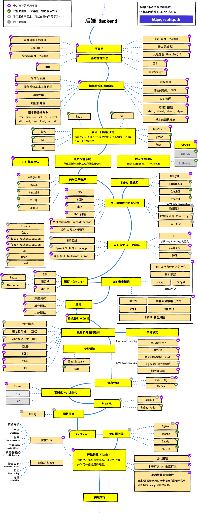
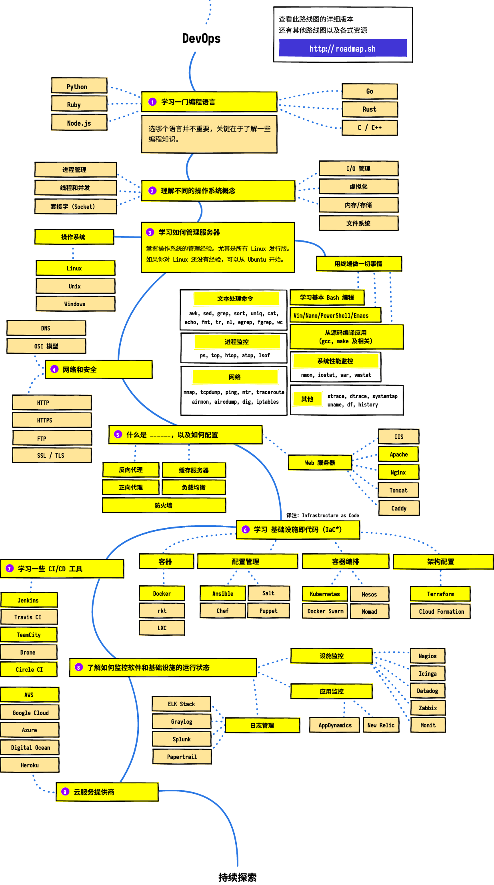

> 在 2020 年成为一个 Web 开发者

在下面，你可以看到一组图表，展示了你成为一个前端、后端或 DevOps 开发者，所需要的学习路径以及相关技术工具。我为我的一个老教授做了这些图表，他想和大学生们分享这些东西，以便给他们提供一个视角；在这里分享这些以帮助社区。

---

<b> 🎉 我们在制作这些路线图的扩展版本 🎉 </b> 关注 <a href="http://roadmap.sh">roadmap.sh</a> 上的更新！

---

<h3 align="center"><strong>本路线图的目标</strong></h3>

> 本路线图的目标是：当你感到迷茫，不知道接下来该学什么的时候，为你展示一下 Web 开发的整体图景作为参考。但也不是鼓励你一定要学习新潮的技术。你应该试着自己去理解：为什么一个工具比其他工具更适合某些情况，并且理解新潮的工具并不适用于所有工作。

<h3 align="center"><strong>新手提示</strong></h3>

> 这些路线图涵盖了各自路线中的所有内容。不要感到有压力：如果你是一个初学者，那么不需要在开始阶段就学习全部内容。我们正在制作相关的初学者版本，并计划在 2020 年的 Backend 和 DevOps 路线图完成后尽快发布。

---

如果你认为有任何值得改进的地方，欢迎提供意见。

## 简体中文翻译

### 翻译状态

|             原版最后更新             |             简中版最后更新             |             繁中版最后更新             |
| :----------------------------------: | :------------------------------------: | :------------------------------------: |
| [![原版最后更新][en-check]](en-repo) | [![简中版最后更新][zh-check]](zh-repo) | [![繁中版最后更新][tw-check]](tw-repo) |

[en-check]: https://img.shields.io/github/last-commit/kamranahmedse/developer-roadmap.svg?style=for-the-badge
[en-repo]: https://github.com/kamranahmedse/developer-roadmap
[zh-check]: https://img.shields.io/github/last-commit/seognil/developer-roadmap.svg?style=for-the-badge
[zh-repo]: https://github.com/seognil/developer-roadmap
[tw-check]: https://img.shields.io/github/last-commit/goodjack/developer-roadmap-chinese.svg?style=for-the-badge
[tw-repo]: https://github.com/goodjack/developer-roadmap-chinese

### 译者前言

大家好，我是 LC 😃，一个普通的前端工程师。

之前就有注意到我们的台湾朋友完成的正體中文翻译版，
但是一些台式用语可能和大陆有所差别，例如 `关联式资料库` - `关系型数据库`。
我做了一个简体中文翻译版（只翻译了路线图的内容），以便分享给更多需要的人 🖖，用语尽量贴近大陆习惯，以方便搜索资料。
感兴趣可以时常关注最新的 [原版项目][en-repo]，可以了解技术词汇原本的英文用词，以便搜索到更多一手资料。

这个路线图本身其实也只是提供了一个快速导览，并没有附上很多具体的学习资料。最好还是 [需要一个 mentor](https://wanqu.co/a/7452/%E4%BD%A0%E8%83%BD%E5%81%9A%E6%88%91%E7%9A%84-mentor-%E5%90%97/)。
同时，在技术工具的选择上，国外的情况可能和国内的情况有所不同。
比如国内大行其道的 `小程序` vs 不温不火的 `PWA` 等等。

所以国内社区其实也有很多不同的更接地气的指南。  
我也做了一个 [前端指南](http://fe.rualc.com/) 类型的项目，收集了更多具体的优秀的学习资料，包括：

- [现代 JavaScript 教程](https://zh.javascript.info/)
- [当你在浏览器中输入 google.com 并且按下回车之后发生了什么？](https://github.com/skyline75489/what-happens-when-zh_CN)
- [[译] Coding Interview University 一套完整的学习手册帮助自己准备 Google 的面试](https://github.com/jwasham/coding-interview-university/blob/master/translations/README-cn.md)
- [10 分钟速成课：学习技能](https://www.bilibili.com/video/av16785517)

如此等等……拆分整理成不同的阶段文章  
（目前还在编写中，目标是完全覆盖前端基本路线）

感兴趣可以看一看 [→ 前端指南 ←](https://github.com/seognil/fe-foundation)

 

不多说了，下面来看一下路线图吧。

顺便再吐个槽，balsamiq 这个排版软件真是令人一言难尽……以前端的视角用起来非常难受，
这就好像 2020 年做前端开发还在用 DreamWeaver 2003 手动拖拽来做页面一样……
以后有机会的话想用 sketch 甚至是 keynote 重做一版，或者用 React 做成带交互的版本（坑挖好了！

## 介绍

## 前端路线图

 

## 后端路线图

 

## DevOps 路线图

 

## 🚦 改进

如果你认为路线图可以改进，请在 issues 中进行讨论（[原 repo 的 issues 板块](https://github.com/kamranahmedse/developer-roadmap/issues)）。另外，我（原作者）将持续改进，你可以 watch 这个 repo 或在 [roadmap.sh](http://roadmap.sh) 上订阅以便时常来看看。

## 🙌 贡献

> 查看 [贡献指南（未翻译）](./CONTRIBUTING.md) 了解如何更新路线图（请提到原版项目中）

- 提一个改进的 PR
- 在 issues 中讨论看法
- 传播和分享
- 提供反馈意见（原作者） 

## 授权协议

查看 [LICENSE](./LICENSE) 了解详情
